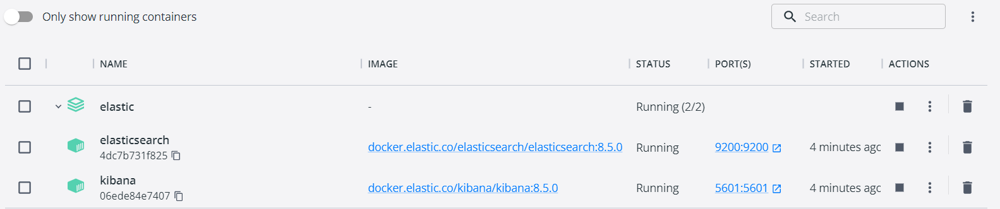

# Deploy elastic in dockers

## Deploy elastic

### Docker Compose

* go to:

    /docker-compose/elastic

* run, add -d to run as demon

    docker-compose up
    docker-compose up -d

* stop

    docker-compose down

### elastic checks

* enter the elastic url

    http://localhost:9200/

* you will have a response as follows to see if the cluster is healthy

    {
      "name" : "elastic_node",
      "cluster_name" : "es-cluster",
      "cluster_uuid" : "SP-yiYQJQO27yeTviEfmBg",
      "version" : {
        "number" : "8.5.0",
        "build_flavor" : "default",
        "build_type" : "docker",
        "build_hash" : "c94b4700cda13820dad5aa74fae6db185ca5c304",
        "build_date" : "2022-10-24T16:54:16.433628434Z",
        "build_snapshot" : false,
        "lucene_version" : "9.4.1",
        "minimum_wire_compatibility_version" : "7.17.0",
        "minimum_index_compatibility_version" : "7.0.0"
      },
      "tagline" : "You Know, for Search"
    }

### configure kibana

* enter kibana url

    http://localhost:5601/

### Links

* Docker versions:

https://www.docker.elastic.co/r/elasticsearch

* Elastic version:

https://docs.docker.com/compose/compose-file/compose-versioning/

* Reference:

https://quoeamaster.medium.com/deploying-elasticsearch-and-kibana-with-docker-86a4ac78d851
https://jinnabalu.com/single-node/